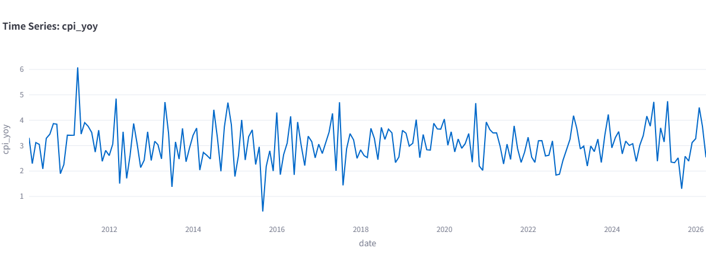

# 宏观经济数据分析可视化平台
一个用于中国宏观经济指标自动分析、交互式可视化、数据看板展示的完整项目

## 项目简介
本项目基于真实宏观经济数据（GDP、CPI、PMI 等核心指标），实现自动化数据更新、指标计算、交互式看板与多图表联动，可用于经济趋势分析、风险预警、可视化展示等真实业务场景。

项目具备完整的工程化结构：数据采集 → 指标计算 → 自动化调度 → 交互式看板 → 云端部署。

---

## 核心功能
✅ **自动化数据调度**：每天定时自动更新经济数据  
✅ **核心指标自动计算**：同比增速、环比变化、3月移动平均、运行状态预警  
✅ **交互式可视化看板**：支持指标切换、年份筛选、图表实时联动  
✅ **多图表联动展示**：趋势图 + 增速柱状图 + 指标卡片 + 数据表格  
✅ **一键部署上线**：支持本地运行与 Streamlit Cloud 云端部署  

---

## 看板功能预览
- 经济指标选择：GDP / CPI / PMI
- 年份范围动态筛选
- 核心指标实时显示（最新值、同比增速、3月均线、风险状态）
- 双图表联动更新
- 原始数据明细展示
---

## 看板功能截图

### 1. 数据集概览

  

展示 GDP、CPI、失业率、政策利率、汇率等核心宏观经济指标的原始数据，支持排序与快速数据探索。

### 2. 时间序列趋势分析

  

交互式绘制经济指标随时间的变化趋势，以 CPI 同比为例，直观呈现指标波动特征、周期性变化与关键拐点。

### 3. 指标相关性热力图

  

通过热力图量化展示各经济指标间的皮尔逊相关系数，直观呈现变量间的线性关联强度，为宏观经济联动分析提供数据支撑。
---

## 项目文件结构
- `main.py`：主程序，交互式数据看板
- `auto_update.py`：自动化数据更新调度脚本
- `metrics.py`：核心经济指标计算模块
- `data/`：数据文件夹
  - `economic_data.csv`：经济指标数据集
- `assets/`：项目截图与资源文件
- `requirements.txt`：项目依赖清单
- `README.md`：项目说明文档
- ---

##  本地运行指南
### 1. 安装依赖
pip install -r requirements.txt

### 2. 启动看板
streamlit run main.py

### 3. 启动自动化调度（可选）
python auto_update.py

---

## 云端部署说明
由于 Streamlit Community Cloud 账号临时限流，本项目目前采用本地运行方式验证，完整部署流程如下：
1. 登录 [share.streamlit.io](https://share.streamlit.io)
2. 绑定本 GitHub 仓库
3. 选择 `main.py` 作为入口文件
4. 点击 Deploy，约 1-2 分钟即可生成公网可访问链接
---

## 项目亮点（留学申请向）
- 完整数据工程流程：数据处理 → 指标分析 → 可视化看板 → 自动化调度 → 云端部署
- 高质量交互式界面，具备真实业务应用价值
- 代码模块化、结构清晰，易于理解与扩展
- 可直接作为数据分析/经济分析/数据科学类项目展示
---

## 开发者说明
本项目为迭代式开发成果：
- 迭代1：基础看板 + 数据可视化
- 迭代2：自动化调度 + 交互式联动 + 指标计算 + 完整部署
