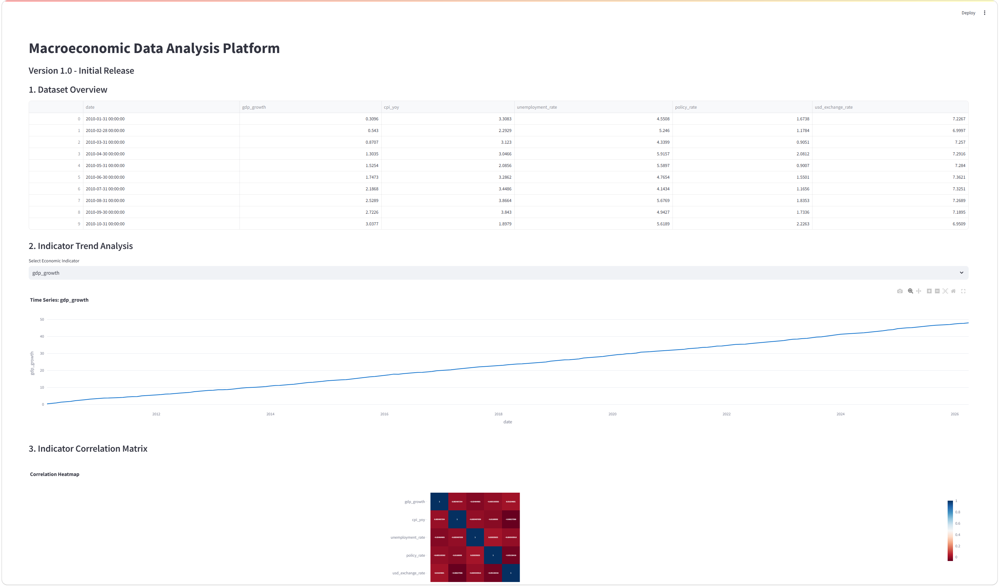

# 宏观经济数据分析平台
基于Python构建的自动化宏观经济数据采集、清洗与交互式可视化分析平台，用于金融科技与量化金融方向的项目展示。

---

## 项目概述
本项目实现了端到端的宏观经济数据处理流程，支持自动生成与模拟关键经济指标数据，并通过交互式看板完成趋势分析与相关性研究，可辅助经济监控与金融决策场景。

## 技术栈
- 开发语言：Python
- 数据处理：Pandas、NumPy
- 可视化工具：Plotly
- 交互看板：Streamlit

## 核心功能（v1.0 初始版本）
- 宏观经济指标数据自动化生成与采集
- 标准化数据清洗与预处理流水线
- 多指标时间序列趋势分析
- 经济指标相关性热力图分析
- 可在本地运行的交互式Web看板

## 项目结构
```
economic-data-platform/
├── main.py                 # Streamlit 看板入口文件
├── README.md               # 项目说明文档
├── requirements.txt        # 依赖库清单
├── .gitignore              # Git 忽略配置文件
├── src/
│   ├── __init__.py         # Python 包标识文件
│   ├── data_fetcher.py     # 数据采集模块
│   └── data_processor.py  # 数据清洗与处理模块
└── data/                   # 数据存储目录
    └── economic_data.csv   # 生成的宏观经济数据文件
```
## 效果预览


## 本地运行指南

### 1. 环境准备
项目基于 Python 开发，推荐使用 Python 3.8 及以上版本运行。
### 2. 安装依赖
在项目根目录下运行以下命令，一键安装所有依赖库：
```bash
# 方式1：使用默认PyPI源
pip install -r requirements.txt

# 方式2：使用清华镜像源（推荐，速度更快）
pip install -r requirements.txt -i https://pypi.tuna.tsinghua.edu.cn/simple
```
### 3. 生成数据
运行数据采集脚本，生成模拟宏观经济数据：
```bash
python src/data_fetcher.py
```
### 4. 启动交互式看板
```bash
streamlit run main.py
